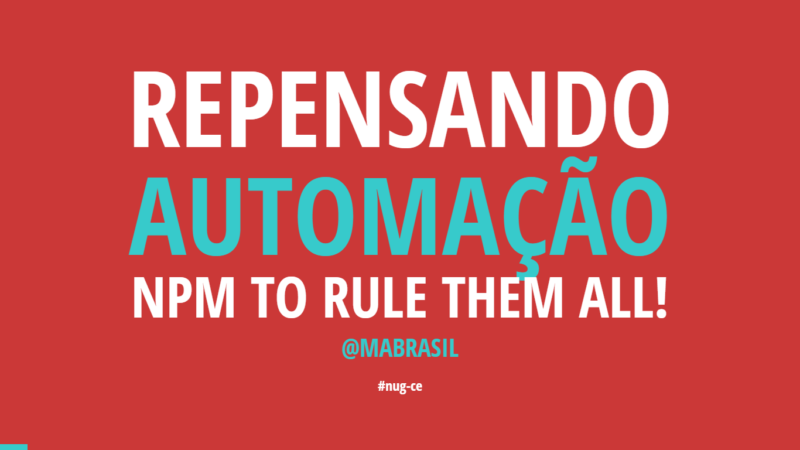

# Repensando automação: NPM to rule them all

## The talk

- **Title:** *Repensando automação: NPM to rule them all*
- **When:** November, 21
- **Where:** Universidade de Fortaleza - Unifor.
- **Attendees:** ≈50
- **Description:** Somethings in the JavaScript world may require a considerable number of tasks: managing assets, styles compilation and minification, JavaScript files concatenation, minification and compression etc. We have many amazing tools to help us in these processes: [Grunt](http://gruntjs.com/) and [Gulp](http://gulpjs.com/) are the most popular these days - but are they really necessary?
- **Presentation:** [See it live here](http://nug-ce-repensando-automacao.surge.sh/#/).

## The slides

These slides are made using [spectable](https://github.com/FormidableLabs/spectacle) v.0.1.6. To get more info on how to run and that kind of things, visit the project's page.

The slides' content is licensed under a [Creative Commons Attribution 3.0 Unported License](http://creativecommons.org/licenses/by/3.0/deed.en_GB).
